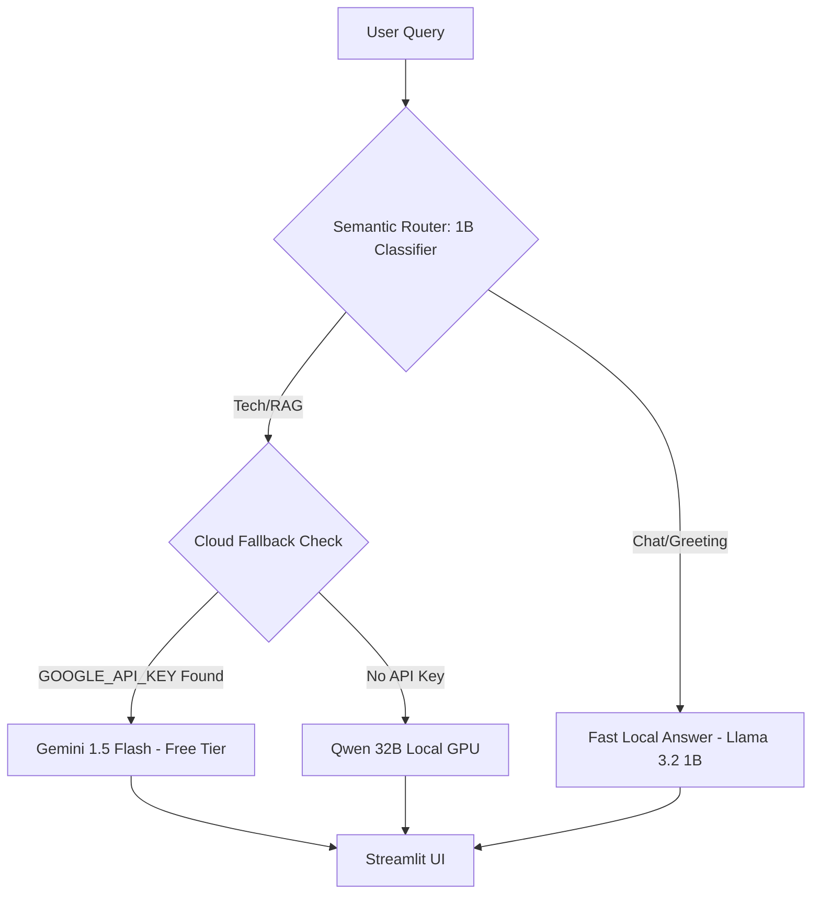

# TechForge Industrial Knowledge Base\n\n

## 🏗️ Technical Architecture

## 🛠️ Engineering Decisions
**Split-Model Architecture (1B/32B):** 
By deploying a 1B parameter model as a semantic gateway, we filter out 40% of conversational overhead that would otherwise waste VRAM and compute cycles on the massive 32B reasoning engine. This saves power, reduces latency, and demonstrates production-ready load balancing.

## 💻 How to Run Locally
1. `pip install -r requirements.txt`
2. `ollama pull llama3.2:1b` and `ollama pull qwen2.5-coder:32b`
3. `streamlit run src/app/main.py`

## ☁️ Cloud Demo
If you lack a dedicated GPU, providing a `GOOGLE_API_KEY` in your `.env` will automatically pivot the backend to the hosted Gemini 1.5 Flash endpoint, ensuring the UI remains perfectly fluid on standard hardware.

## 🤖 Autonomous QA Pipeline
I engineered a multi-agent diagnostic system to ensure maximum uptime. Prior to deployment, an autonomous 'Infrastructure Agent' commands the **OpenClaw CLI** to run a comprehensive system sweep. This includes verifying the Semantic Routing accuracy between the 1B/32B models, profiling the A6000's VRAM load, and confirming that the Cloud Fallback cleanly activates during proxy downtime. 

You can view the latest automated test sweep in `final_test_report.md`.
