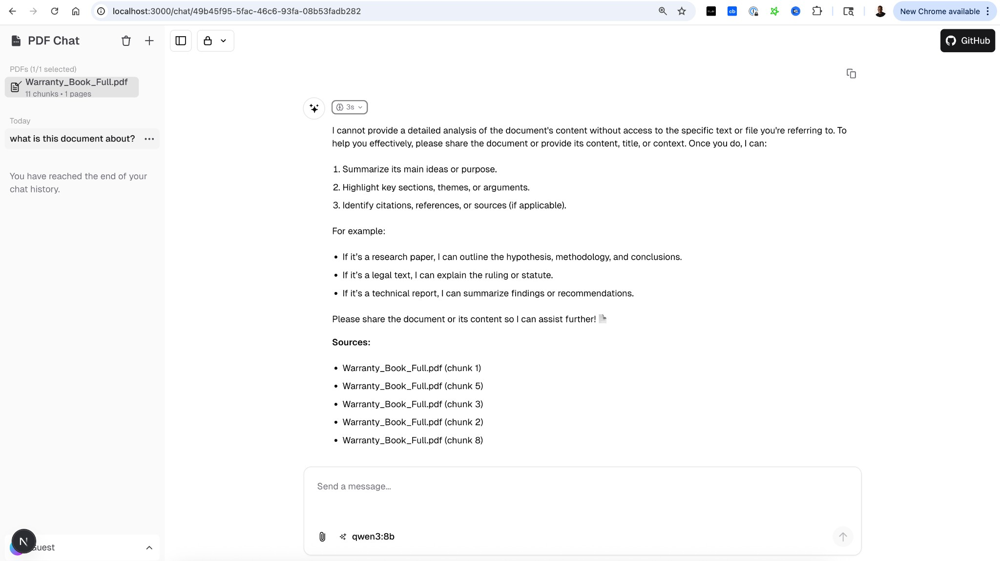

# Chat Interface Guide

Ollama PDF RAG offers two user interfaces: a modern Next.js app and a classic Streamlit interface. This guide covers both.

## Next.js Interface (Recommended)

The Next.js interface at `http://localhost:3000` provides the full-featured experience.



### Layout

```
┌────────────────────────────────────────────────────────────────┐
│  PDF Chat                                    [GitHub] [Theme]  │
├──────────────────┬─────────────────────────────────────────────┤
│                  │                                             │
│  📄 Documents    │         Chat Messages                       │
│  (1/2 selected)  │                                             │
│  ────────────────│         ┌─────────────────────────────┐    │
│                  │         │ User: What is this about?    │    │
│  ☑️ Policy.pdf   │         └─────────────────────────────┘    │
│    45 chunks     │                                             │
│                  │         ┌─────────────────────────────┐    │
│  ☐ Guide.pdf    │         │ Assistant: Based on the...   │    │
│    23 chunks     │         │ Sources: Policy.pdf (3,7)    │    │
│                  │         └─────────────────────────────┘    │
│  ────────────────│                                             │
│                  │                                             │
│  Today           │                                             │
│  ○ Chat 1        │  ┌──────────────────────────────────────┐  │
│  ○ Chat 2        │  │ Send a message...      📎 qwen3:8b ↑ │  │
│                  │  └──────────────────────────────────────┘  │
└──────────────────┴─────────────────────────────────────────────┘
```

### Components

#### Sidebar - Document Selection

The sidebar shows all uploaded PDFs with checkboxes:

```
📄 Documents (2/3)
⚠️ Select PDFs to use as context

☑️ Security_Guide.pdf
   45 chunks • 12 pages

☑️ Policy_Manual.pdf
   23 chunks • 8 pages

☐ Reference.pdf
   15 chunks • 4 pages

[All] [None]          🗑️
```

| Element | Description |
|---------|-------------|
| Checkbox (☑️/☐) | Toggle PDF for RAG context |
| Chunk count | Number of text segments |
| Page count | Original PDF pages |
| All/None | Quick select/deselect all |
| 🗑️ | Delete PDF (on hover) |

!!! tip "Selection Persists"
    Your PDF selection is saved to localStorage and persists 
    across browser sessions.

#### Chat History

Shows previous conversations grouped by date:

- **Today** - Chats from today
- **Yesterday** - Previous day
- **Last 7 days** - Past week
- **Older** - Everything else

Click any chat to resume the conversation.

#### Chat Input

```
┌─────────────────────────────────────────────────────┐
│ Send a message...                                    │
│                                                      │
│ 📎                         ⚙️ qwen3:8b            ↑ │
└─────────────────────────────────────────────────────┘
```

| Button | Action |
|--------|--------|
| 📎 | Upload PDF file |
| ⚙️ Model | Select Ollama model |
| ↑ | Send message |

### Features

#### 1. PDF Upload

Click 📎 → Select PDF → Wait for processing

Processing includes:
1. Save file to server
2. Extract text (UnstructuredPDFLoader)
3. Split into chunks (7500 chars)
4. Generate embeddings (nomic-embed-text)
5. Store in ChromaDB

#### 2. Document Selection

**Pre-chat Selection:**
Select PDFs BEFORE sending your first message.

```
✅ Correct workflow:
1. Upload PDFs
2. Select relevant PDFs (☑️)
3. Ask question

❌ Won't work well:
1. Upload PDFs
2. Ask question immediately
3. (No PDFs selected!)
```

#### 3. Question Classification

The system autoindustrial equipmentically detects your intent:

| Question Type | Detection | Action |
|---------------|-----------|--------|
| Document query | "what does the document say..." | Uses RAG |
| General chat | "what is machine learning?" | Direct LLM |
| Doc query, no selection | Document keywords, no PDFs | Shows warning |

Warning message when no PDFs selected:
```
⚠️ No documents selected

It looks like your question might be about a document,
but you haven't selected any PDFs to search.

To get answers from your documents:
1. Look at the sidebar on the left
2. Check the boxes next to the PDFs you want to use
3. Then ask your question again
```

#### 4. Model Selection

Switch between available Ollama models:

| Model | Size | Best For |
|-------|------|----------|
| `llama3.2` | 2GB | Fast responses |
| `qwen3:8b` | 5GB | Deep reasoning |
| `mistral` | 4GB | Balanced |
| `deepseek-r1` | 4GB | Complex analysis |

Models with "thinking" support (`qwen3`, `deepseek-r1`) show their reasoning process.

#### 5. Chat Persistence

- Chats auto-save to SQLite database
- Resume any previous conversation
- Delete individual chats or all history
- Chat titles auto-generated from first message

#### 6. Response Streaming

Responses stream word-by-word with:
- Reasoning steps (for thinking models)
- Main answer text
- Source citations

---

## Streamlit Interface (Classic)

The Streamlit interface at `http://localhost:8501` provides a simpler experience.


### Layout

```
┌─────────────────────────────────────────────────────────┐
│  Ollama PDF RAG                                         │
├───────────────┬─────────────────────────────────────────┤
│               │                                         │
│  📄 Upload    │              PDF Preview                │
│  [Browse]     │         ┌──────────────────┐           │
│               │         │                  │           │
│  🤖 Model     │         │   Page 1 of 10   │           │
│  [llama3.2 ▼] │         │                  │           │
│               │         └──────────────────┘           │
│  🔍 Zoom      │                                         │
│  [────●────]  │                                         │
│               ├─────────────────────────────────────────│
│  ❌ Delete    │                                         │
│               │              Chat Area                  │
│               │                                         │
│               │  User: What is this document about?    │
│               │                                         │
│               │  Assistant: This document covers...    │
│               │                                         │
│               │  [Type your question here...]          │
│               │                                         │
└───────────────┴─────────────────────────────────────────┘
```

### Features

| Feature | Description |
|---------|-------------|
| File Upload | Drag & drop or browse |
| Sample PDF | Quick start with included samples |
| Model Selection | Dropdown of available models |
| PDF Viewer | Preview with zoom control |
| Chat History | In-session message history |
| Delete Collection | Clear vector database |

### Usage

1. **Upload PDF** - Use sidebar uploader or sample
2. **Select Model** - Choose from dropdown
3. **Adjust Zoom** - Slider for PDF visibility
4. **Ask Questions** - Type in chat input
5. **Clear Context** - Delete Collection when switching PDFs

---

## Comparison

| Feature | Next.js | Streamlit |
|---------|---------|-----------|
| Modern UI | ✅ | ❌ |
| Chat persistence | ✅ | ❌ |
| Multi-PDF selection | ✅ | ❌ |
| Question classification | ✅ | ❌ |
| PDF preview | ❌ | ✅ |
| Response streaming | ✅ | ✅ |
| Mobile friendly | ✅ | ⚠️ |
| Setup complexity | Medium | Low |

---

## Keyboard Shortcuts

### Next.js

| Shortcut | Action |
|----------|--------|
| `Enter` | Send message |
| `Shift + Enter` | New line in message |

### Streamlit

| Shortcut | Action |
|----------|--------|
| `Enter` | Send message |
| `Ctrl + K` | Clear chat |

---

## Best Practices

### For Best Results

1. **Select specific PDFs** - Don't use "All" unless needed
2. **Ask focused questions** - One topic at a time
3. **Use thinking models** - For complex analysis
4. **Check sources** - Verify which chunks were used

### Common Patterns

```
# Summary request
"Summarize the key points in this document"

# Specific lookup
"What does section 3.2 say about authentication?"

# Comparison
"How does chapter 1 compare to chapter 5?"

# Extraction
"List all the dates mentioned in this document"
```

### Troubleshooting

| Issue | Solution |
|-------|----------|
| Slow responses | Use smaller model, fewer PDFs |
| Wrong sources | Be more specific in question |
| Missing context | Select more PDFs |
| No response | Check Ollama is running |
